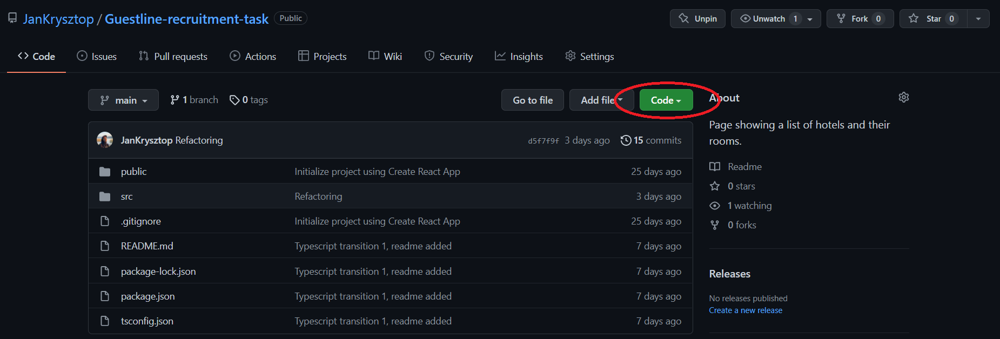
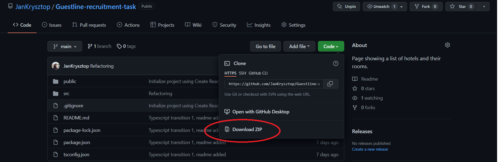

# Guestline Recruitment Task

## How to start up this project :

#### 1. First, click on the green button that says "Code"

#### 2. Then select "Download ZIP" option

#### 3. Unzip downloaded folder to target location

#### 4. Install node.js from this link : https://nodejs.org/en/

#### 5. Open up a console (powershell/bash)

#### 6. Navigate to where "Guestline-recruitment-task-main" is located

    cd /.../Guestline-recruitment-task-main

#### 7. While inside this folder type in command:

    npm install

#### 8. And finally use this command to start local server and view project in the browser:

    npm start

## Content of the task:

To get the information to present, you will need to query the following API:

https://obmng.dbm.guestline.net/api/hotels?collection-id=OBMNG

This returns a list of hotels, with an Id. The Id can be used to query this query for the room types:

https://obmng.dbm.guestline.net/api/roomRates/OBMNG/[hotelId] for example, https://obmng.dbm.guestline.net/api/roomRates/OBMNG/OBMNG1

Guests using the site should be able to:

- Filter based on the star rating of the hotel, that is, given I have selected 3 stars, then I am able to see all hotels with a 3 and above rating.
- Filter based on the capacity of the room. That is, when I have selected 1 adult and 1 child then I am able to see all rooms with at least that capacity. Therefore, I will not be shown any rooms which do not accept children.
- View all images of the displayed hotel
- See hotel details (including hotel name, address and star rating) and room details (including room type, max adults, max children and long description)

For other requirements, please see the attached [mockup sketch](https://gxpservicesstagestorage.blob.core.windows.net/hotelpagecodetest/9SYKaPm4q85GqTZzno7AT3.png). Note that the crossed boxes on mockup is the location for images. The URLs can be found in the response to the initial request.
